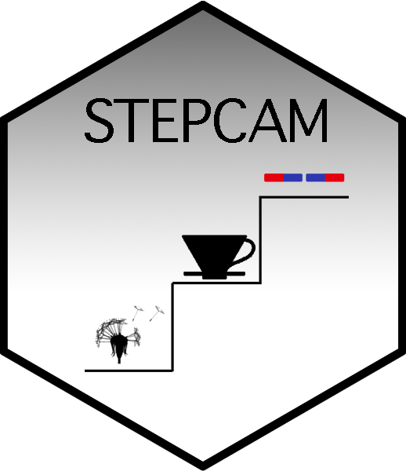

# STEPCAM 
Stepwise Community Assembly Model repository for CRAN-R

Branch|[]
---|---
master|

# What is STEPCAM?
STEPCAM is a STEPwise Community Assembly Model, and aims to infer underlying processes driving community assembly. It is mainly suitable for researchers in the possession of the combination of abundance and trait data, and allows the researcher to infer  the relative contribution of Dispersal Assembly (DA), Habitat Filtering (HF) and Limiting Similarity (LS).
Starting from the full species pool, STEPCAM removes species in stepwise function, in order to recover the trait-distribution observed in the focal community. 
Choice of which species to remove depends on the relative contribution of dispersal assembly, habitat filtering, and limiting similary. 
- At a dispersal assembly removal step, a species is randomly selected inversely proportional to the abundance of the species across all communities. 
- At a habitat filtering removal step, a species that is most dissimilar from the communities' optimal trait value is removed. 
- At a limiting similarity removal step, a species that is most similar with the other remaining species is removed. 

The approximate Bayesian framework uses ABC-SMC to estimate the relative contribution of DA, HF and LS. The output is a posterior distribution across the three paremeters of interest.

More information about STEPCAM, and it's uses, can be found in the original paper describing STEPCAM:

Fons van der Plas, Thijs Janzen, Alejandro Ordonez, Wimke Fokkema, Josephine Reinders, Rampal S. Etienne, and Han Olff 2015. A new modeling approach estimates the relative importance of different community assembly processes. Ecology 96:1502-1515.

# STEPCAM version updates
Version 1.2 
  - STEPCAM can now be found on GitHub: https://github.com/thijsjanzen/STEPCAM 
  - Merged STEPCAM code with the supplementary code of Hauffe et al. 2016 
  - Added two vignettes 
  - Added a large number of code tests 

Version 1.1.2 
  - updated the prior - now all three processes have a mean prior value of 1/3, and a log-normal kind shape in [0,1]

Version 1.1.1 
- fixed a bug in the ABC-SMC code leading to the error "Error in if (fit < threshold)  : missing value where TRUE/FALSE needed" 

Version 1.1 
- calculation of the diversity indices is plit up into two parts: calculating the ordination axes, and the actual calculation of the indices - this allows for a speed up of the code by moving the calculation of the ordination axes outside the SMC algorithm. Many thanks to Torsten Hauffe for this improvement! 
- Corrected scaling of the dbFD function - it now always treats abundances as presence/absence data, much thanks to Torsten Hauffe for pointing this out! 
- updated references 

## Papers using STEPCAM

Hauffe, Torsten, Christian Albrecht, and Thomas Wilke. Assembly processes of gastropod community change with horizontal and vertical zonation in ancient Lake Ohrid: a metacommunity speciation perspective. Biogeosciences 13.10 (2016): 2901-2911.

Janzen T, Alzate A, Muschick M, Maan ME, van der Plas F, and Etienne RS. Community assembly in Lake Tanganyika cichlid fish: quantifying the contributions of both niche-based and neutral processes. Ecology and Evolution 2017; 00:1–11. doi:10.1002/ece3.2689..

Fons van der Plas, Thijs Janzen, Alejandro Ordonez, Wimke Fokkema, Josephine Reinders, Rampal S. Etienne, and Han Olff (2015). A new modeling approach estimates the relative importance of different community assembly processes. Ecology 96:1502-1515.
